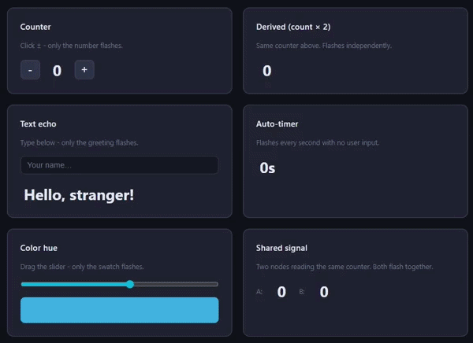

<div align="center">
    <picture>
        
    </picture>

### Vane — Frontend development, the Go way.

[Get Started](https://filipejohansson.github.io/vane/docs/installation) | [Documentation](https://filipejohansson.github.io/vane/docs) | [Examples](https://github.com/FilipeJohansson/vane/tree/master/examples)

  
</div>

---

## Write UI in Go. Compile straight to the DOM.

Vane is a Go-native frontend framework for building modern web applications with fine-grained reactivity, direct DOM updates, and JSX-like syntax.

Write your frontend in Go.

Keep your types.

Keep your tooling.

Ship to the browser with WebAssembly.

<div align="center">



</div>

## Why Vane?

<details>
  <summary>Go-native</summary>
  
Build your UI using Go functions, structs, interfaces, packages, and the Go toolchain.

No second language required. No JavaScript framework required.
</details>

<details>
  <summary>No Virtual DOM</summary>
  
Vane does not rerender component trees or diff a virtual DOM.

Reactive bindings update the DOM nodes they depend on directly.
</details>

<details>
  <summary>Fine-grained reactivity</summary>
  
Signals track exactly which parts of the UI depend on them.

When a signal changes, only those bindings run again.
</details>

<details>
  <summary>Type-safe</summary>
  
Your application logic, components, and data remain within Go's type system.
</details>

<details>
  <summary>Everything you need for a real app</summary>

- Components
- Signals & reactive state
- Routing & nested layouts
- Forms
- Async operations
- Shared state
- Accessibility helpers
- Portals
- Error boundaries
- Head management
- Hot reload
</details>

## What Vane is good for

Vane is designed for interactive web applications where most of the UI runs in the browser.

- Single-page applications
- Dashboards and admin panels
- SaaS applications
- Internal tools
- Interactive forms and workflows
- Real-time interfaces

For content-heavy sites where server-rendered HTML and search indexing are the primary concerns, a server-rendered framework may be a better fit.

## A component in Vane

```go
type todo struct {
	id, text string
	done     bool
}

func todoItem(t todo, onToggle func()) core.Node {
	cls := "todo-item"
	if t.done {
		cls = "todo-item done"
	}
	return (
		<li key={t.id} className={cls}>
			<span onClick={func(core.MouseEvent) { onToggle() }}>{t.text}</span>
		</li>
	)
}

func TodoList() core.Node {
	todos := core.NewSignal([]todo{
		{id: "1", text: "Learn Vane", done: true},
		{id: "2", text: "Ship something", done: false},
	})

	toggle := func(id string) {
		list := todos.Get()
		next := make([]todo, len(list))
		copy(next, list)
		for i, t := range next {
			if t.id == id {
				next[i].done = !t.done
			}
		}
		todos.Set(next)
	}

	return (
		<ul>
			{for _, t := range todos.Get() {
				todoItem(t, func() { toggle(t.id) })
			}}
		</ul>
	)
}
```

## Get started in under a minute.

### Install

Vane requires Go 1.25 or newer.
```bash
go install github.com/filipejohansson/vane@latest
```

### Create an application

```bash
mkdir my-app && cd my-app
vane init github.com/you/my-app
```

### Run it

```bash
vane run .
# open http://localhost:8080
```

`vane init <module>` scaffolds a complete Vane application in the current directory.

> See the [Installation guide](https://filipejohansson.github.io/vane/docs/installation) for project structure, configuration, ports, and build options.

## Built with Vane

The [Vane documentation](https://filipejohansson.github.io/vane/) site is built and served with Vane itself.

Using Vane in a project? Open a PR and add it here.

## Editor support

Vane provides a VS Code extension with syntax highlighting, diagnostics, hover, and go-to-definition.

[Install Vane from the VS Code Marketplace](https://marketplace.visualstudio.com/items?itemName=FilipeJohansson.vscode-vane)

See [tools/vscode-vane/README.md](tools/vscode-vane/README.md) for development, packaging, and known limitations.

## Documentation

The [Vane Docs](https://filipejohansson.github.io/vane/docs) cover concepts, components, reactivity, Vane syntax, DOM APIs, accessibility, routing, state management, error handling, and building for production.

New to Vane? Start with the [Tutorial](https://filipejohansson.github.io/vane/docs/tutorial): build a complete todo list app step by step.

## Getting help

- **Bugs** → [GitHub Issues](https://github.com/FilipeJohansson/vane/issues).
- **Questions, ideas, "how would I..."** → [GitHub Discussions](https://github.com/FilipeJohansson/vane/discussions).
- **Security vulnerabilities** → do not open a public issue, see [SECURITY.md](SECURITY.md).
- Want to contribute code? See [CONTRIBUTING.md](CONTRIBUTING.md).

## Status

Vane is currently pre-1.0.

The API may evolve before 1.0 as the framework matures.
Only the latest release is currently supported.
